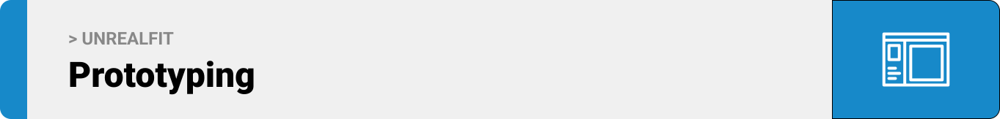
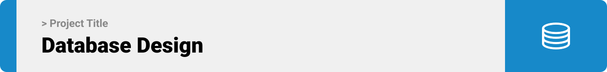

<br><br>

<!-- project philosophy -->

UnrealFit is a web-based wardrobe assistance platform that utilizes augmented reality (AR) technology to redefine how users choose their outfits. The website offers a seamless and immersive experience for users to explore, try on, and select their clothing items and help them find the places to get them.

### User Stories

User:

-As a user, I want to easily register for an account, providing necessary details such as username, email, and password.
-As a user, I want a secure sign-in process to access my account.
-As a user, I want to create new occasions, providing details such as the type of occasion, date, and location.
-As a user, I want to add descriptions or notes to my occasions, helping me remember specific details or requirements.
-As a user, I want to browse and select costumes associated with each occasion.
-As a user, I want the ability to view costume details, including images, sizes, and prices.
-As a user, I want to use augmented reality (AR) to virtually try on selected costumes.
-As a user, I want the option to share my virtual try-on images with friends for feedback.
-As a user, I want to choose a location to purchase the selected costumes.
-As a user, I want information about nearby stores or online options where I can buy the chosen costumes.

Admin:

-As an admin, I want a comprehensive dashboard overview displaying key metrics, user statistics, and recent activities.
-As an admin, I want to view a list of all users, including their registration details and activity history.
-As an admin, I want to search for specific users and filter user data based on criteria such as registration date.
-As an admin, I want to see a list of all occasions created by users, including details like occasion type, date, and associated costumes.
-As an admin, I want the ability to edit or remove occasions if needed.

<br><br>

<!-- Prototyping -->


### Wireframes

| Login screen                            | Register screen                       | Landing screen                        |
| --------------------------------------- | ------------------------------------- | ------------------------------------- |
|  |  |  |

### Mockups

| Home screen                             | Occasion Screen                       | Virtual try-on Screen                 |
| --------------------------------------- | ------------------------------------- | ------------------------------------- |
|  |  |  |

<br><br>

<!-- Implementation -->


> Using the wireframes and mockups as a guide, we implemented the Coffee Express app with the following features:

### User Screens (Mobile)

| Login screen                              | Register screen                         | Landing screen                          | Loading screen                          |
| ----------------------------------------- | --------------------------------------- | --------------------------------------- | --------------------------------------- |
|  |  |  |  |
| Home screen                               | Menu Screen                             | Order Screen                            | Checkout Screen                         |
|  |  |  |  |

### Admin Screens (Web)

| Login screen                            | Register screen                       | Landing screen                        |
| --------------------------------------- | ------------------------------------- | ------------------------------------- |
|  |  |  |
| Home screen                             | Menu Screen                           | Order Screen                          |
|  |  |  |

<br><br>

<!-- Tech stack -->


### Coffee Express is built using the following technologies:

- This project uses the [Flutter app development framework](https://flutter.dev/). Flutter is a cross-platform hybrid app development platform which allows us to use a single codebase for apps on mobile, desktop, and the web.
- For persistent storage (database), the app uses the [Hive](https://hivedb.dev/) package which allows the app to create a custom storage schema and save it to a local database.
- To send local push notifications, the app uses the [flutter_local_notifications](https://pub.dev/packages/flutter_local_notifications) package which supports Android, iOS, and macOS.
  - 🚨 Currently, notifications aren't working on macOS. This is a known issue that we are working to resolve!
- The app uses the font ["Work Sans"](https://fonts.google.com/specimen/Work+Sans) as its main font, and the design of the app adheres to the material design guidelines.

<br><br>

<!-- How to run -->


> To set up Coffee Express locally, follow these steps:

### Prerequisites

This is an example of how to list things you need to use the software and how to install them.

- npm
  ```sh
  npm install npm@latest -g
  ```

### Installation

_Below is an example of how you can instruct your audience on installing and setting up your app. This template doesn't rely on any external dependencies or services._

1. Get a free API Key at [https://example.com](https://example.com)
2. Clone the repo
   ```sh
   git clone https://github.com/your_username_/Project-Name.git
   ```
3. Install NPM packages
   ```sh
   npm install
   ```
4. Enter your API in `config.js`
   ```js
   const API_KEY = "ENTER YOUR API";
   ```

Now, you should be able to run Coffee Express locally and explore its features.
