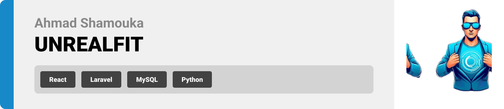
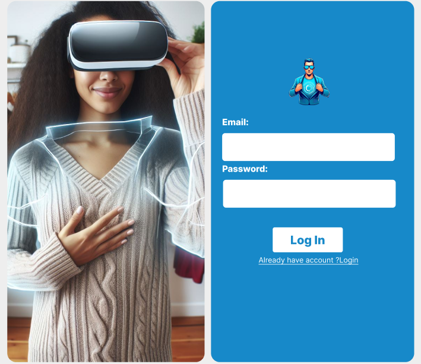

<br><br>

<!-- project philosophy -->

UnrealFit is a web-based wardrobe assistance platform that utilizes augmented reality (AR) technology to redefine how users choose their outfits. The website offers a seamless and immersive experience for users to explore, try on, and select their clothing items and help them find the places to get them.

### User Stories

User:

-As a user, I want to easily register for an account, providing necessary details such as username, email, password, age, country and gender.

-As a user, I want to create new occasions, providing details such as the type of occasion, style, season and budget ramge.

-As a user, I want to select one of the suggested clothes and virtually try-on the cloth using Augmented Reality(AR), I can buy one of the clothes.

Admin:

-As an admin, I want a comprehensive dashboard overview displaying key metrics, user statistics, and recent activities.

-As an admin, I want to view a list of all users, including their registration details and activity history.

-As an admin, I want to see a list of all occasions created by users, including details like occasion type, date, and associated costumes.

<br><br>

<!-- Prototyping -->


### Unrealfit is built using the following technologies:

- This project uses the [React web development library](https://react.dev/) for frontend. React is a JavaScript library for building user interfaces, known for its component-based architecture and efficient rendering using a virtual DOM.
- This Project uses [Laravel framework](https://laravel.com/)for backend,Laravel serves as a backend framework for PHP web development, offering features and tools that streamline backend processes, such as routing, database management, authentication, and API development, empowering developers to build robust and scalable server-side applications efficiently.
- For persistent storage (database), the app uses the [MySQL](https://www.mysql.com/) MySQL is an open-source relational database management system (RDBMS) that uses SQL for querying, managing, and storing structured data efficiently.


### I designed UNREALFIT using wireframes and mockups, iterating on the design until we reached the ideal layout for easy navigation and a seamless user experience.

<li>Project Figma Design <a href="https://www.figma.com/file/3pi5bFAbK9wTc0FP3Aibwd/UNREALFIT?type=design&node-id=394%3A41&mode=design&t=5YXJMx6uLUv3qrA1-1">Figma</a></li>

### Mockups

| Home screen                          | Occasion Screen                     |
| ------------------------------------ | ----------------------------------- |
|  |  |
| Home screen                          | Occasion Screen                     |
| ------------------------------------ | ----------------------------------- |
|  |  |

| Home screen                       | Occasion Screen                        |
| --------------------------------- | -------------------------------------- |
|  |  |

<br><br>

<!-- Implementation -->

<br><br>

<!-- Tech stack -->


### Database Schema


<br><br>
<br><br>


> Using the wireframes and mockups as a guide, we implemented the Coffee Express app with the following features:

### User Screens (web)

| Home screen                | Occasion Screen             |
| -------------------------- | --------------------------- |
|  |  |

| Home screen                | Occasion Screen                    |
| -------------------------- | ---------------------------------- |
|  |  |

| Sign Up                         | Sign In                         |
| ------------------------------- | ------------------------------- |
|  |  |

### Admin Screens (Web)

| Home screen                | Occasion Screen             |
| -------------------------- | --------------------------- |
|  |  |

| Home screen                | Occasion Screen                    |
| -------------------------- | ---------------------------------- |
|  |  |

| Sign Up                         | Sign In                         |
| ------------------------------- | ------------------------------- |
|  |  |

<br><br>

<!-- How to run -->

<br><br>

<br><br>

<br><br>

> To set up UNREALFIT locally, follow these steps:

### Prerequisites

This is an example of how to list things you need to use the software and how to install them.

### Installation

_Below is an example of how you can instruct your audience on installing and setting up your Website. This template doesn't rely on any external dependencies or services._

1. Clone the repo
   ```sh
   git clone https://github.com/AhmadShamouka/unreal.git
   ```
2. Install NPM packages

   ```sh
   npm install
   ```

3. Install XAMP

   [https://www.apachefriends.org/download.html](https://www.apachefriends.org/download.html)

4. Install composer for Laravel

   ```js
   composer install
   ```

5. Install Python version 3.8.10
   [https://www.python.org/downloads/release/python-3810](https://www.python.org/downloads/release/python-3810/)

6. Install cvzone

   ```sh
   pip install opencv-python
   ```

Now, you should be able to run Coffee Express locally and explore its features.
